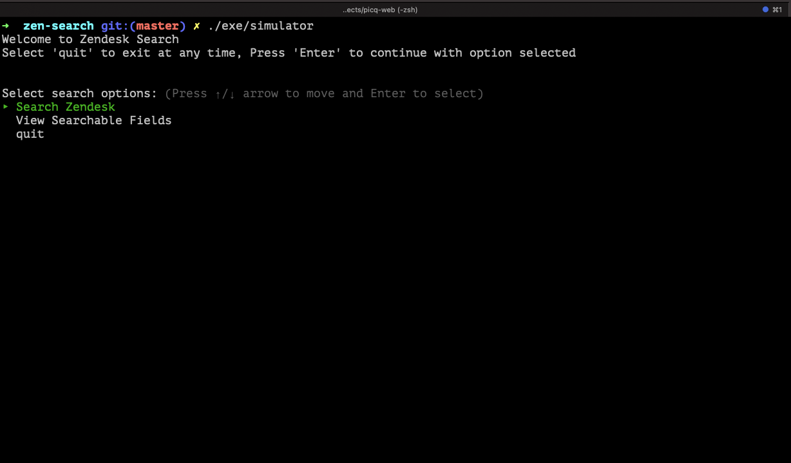
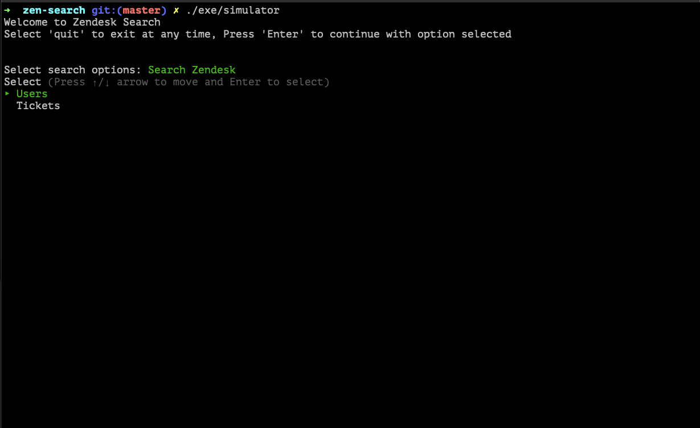
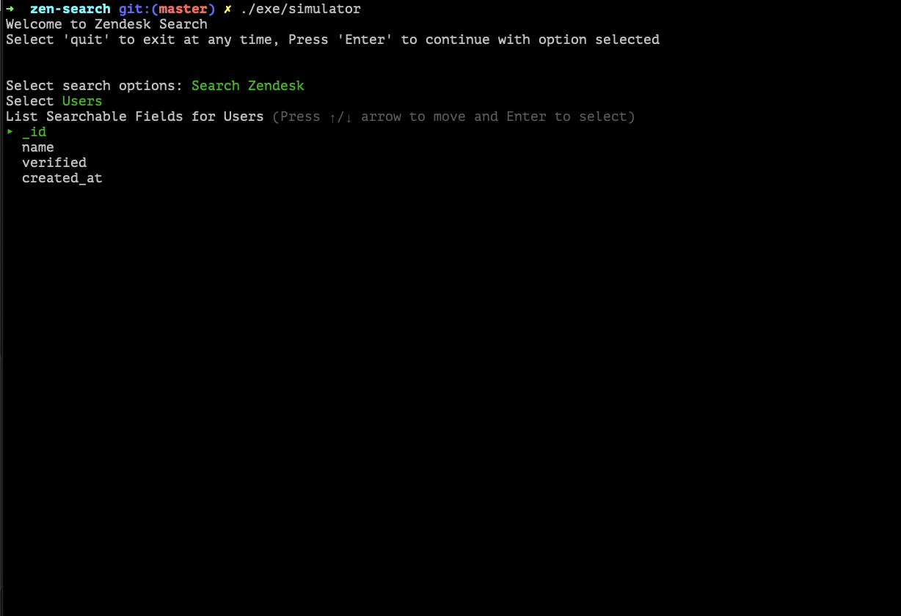
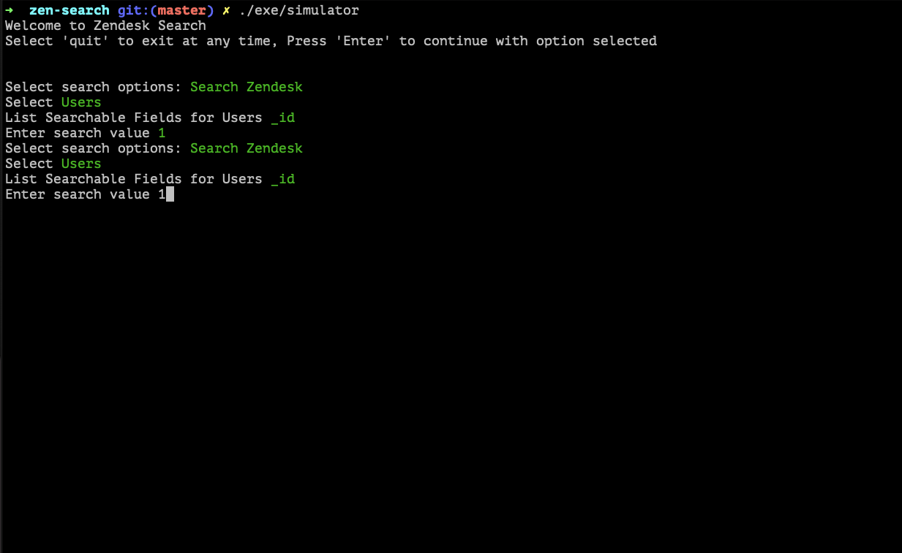
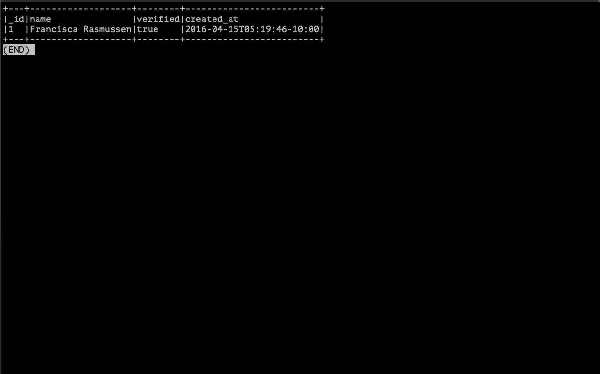

# Zen::Search

`Zen::Search` is a simple command line application to search the user and tickets data and return the results in a human readable format.

# Prerequistes

    - Ruby 2.6+ (Tested with 2.7.2)
    - Ensure data is available as 
       - tickets.json
       - users.json
# Goal statements (From specification PDF)

   1. Feel free to use libraries or roll your own code as you see fit. However, please do not use a
    database or full text search product as we are interested to see how you write the solution.
   2. Where the data exists, values from any related entities should be included in the results, i.e.
    searching tickets should return their assigned user and searching users should return their assigned tickets.
   3. The user should be able to search on any field. Full value matching is fine (e.g. "mar" won't
    return "mary")
   4. The user should also be able to search for missing values, e.g. where a ticket does not have
    an assignee_id.

### Input data

```
├── data 
│   ├── tickets.json
│   ├── users.json
```

## Development or Installation

Download the zen-search.zip into your local folder (OR)

```
git clone git@github.com:elitenomad/zen-search.git
cd zen-search
bundle install

(or)

cd zen-search
bin/setup

```

- After checking out the repo, run `bin/setup` to install dependencies.
- Then, run `rspec spec/` to run the tests. 
- You can also run `bin/console` for an interactive prompt that will allow you to experiment.
    

## Usage

Note: Ensure latest ruby is installed on the system.

1. Unzip the zen-search.zip
2. cd zen-search
3. Run simulator with filename as argument.
4. `chmod ugo+x exe/simulator` (not required, in case its not recognised as a script)

```
cd zen-search
./exe/simulator

```
## Test

```
rspec spec/
```

## Directory structure

```
.
├── CHANGELOG.md
├── Gemfile
├── Gemfile.lock
├── README.md
├── Rakefile
├── bin
│   ├── console
│   └── setup
├── data
│   ├── tickets.json
│   └── users.json
├── exe
│   └── simulator
├── lib
│   └── zen
│       ├── search
│       │   ├── cli.rb
│       │   ├── generate
│       │   │   ├── indexer.rb
│       │   │   ├── ticket_indexer.rb
│       │   │   └── user_indexer.rb
│       │   ├── helpers.rb
│       │   ├── loader.rb
│       │   ├── parse.rb
│       │   ├── services
│       │   │   ├── constants.rb
│       │   │   ├── core.rb
│       │   │   ├── fields.rb
│       │   │   ├── print.rb
│       │   │   ├── tickets.rb
│       │   │   └── users.rb
│       │   ├── tickets.rb
│       │   ├── updater.rb
│       │   ├── users.rb
│       │   └── version.rb
│       └── search.rb
├── spec
│   ├── spec_helper.rb
│   ├── support
│   │   ├── mock.rb
│   │   ├── stringio_patch.rb
│   │   ├── test.json
│   │   ├── tickets.json
│   │   └── users.json
│   └── zen
│       ├── search
│       │   ├── cli_spec.rb
│       │   ├── generate
│       │   │   ├── indexer_spec.rb
│       │   │   ├── ticket_indexer_spec.rb
│       │   │   └── user_indexer_spec.rb
│       │   ├── helpers_spec.rb
│       │   ├── loader_spec.rb
│       │   ├── parse_spec.rb
│       │   ├── services
│       │   │   ├── constants_spec.rb
│       │   │   ├── core_spec.rb
│       │   │   ├── fields_spec.rb
│       │   │   ├── print_spec.rb
│       │   │   ├── tickets_spec.rb
│       │   │   └── users_spec.rb
│       │   ├── tickets_spec.rb
│       │   ├── updater_spec.rb
│       │   └── users_spec.rb
│       └── search_spec.rb
├── usage
│   ├── enter-id.png
│   ├── search-zen.png
│   ├── simulator-demo.mov
│   ├── start.png
│   ├── user-results.png
│   └── users-options.png
└── zen-search.gemspec

17 directories, 59 files
```
# Design and Considerations

- Use `bundle gem` to create a standard folder structure, Reasons are 
    - To ensure the gem acts like a `cmd` tool to start with. 
    - To ensure the gem could be used for API wrappers in future.
- Use `tty-prompt` to have interactive selection of options.
- Use `tty-table` to print the result in human readable format (Used :ascii option).
- Use `tty-pager` to create basic pagination.
- Use `pry` to debug the issues.
- Use `rubocop` to maintain development standard guide.
- When simulator is started.
    - Loads the data
    - Update the collection classes to reflect relationship data.
        - User has_many tickets
        - Ticket belongs to a User
    - Indexes the data
        - UserIndex 
            - Indexes created for Full string and tokensized version of a string. 
            - Didn't create prefix or suffix string indexes.
        - TicketIndex
            - Indexes created for Full string and tokensized version of a string. 
            - Didn't create prefix or suffix string indexes.
- When an option is selected,
    - Lookup both the JSON files and combine the records and display (Brute force)
    - Lookup for the right indexes and display the output.
        - Users
            - finding by Id O(1)
            - finding by name O(1) (depends :) the way input is provided)
            - finding by verified O(1)
            - finding by created_at O(TotalNoOfUsers)
        - Tickets
            - finding by Id O(1)
            - finding by Assignee ID O(1)
            - finding by Subject, Type O(1)
            - finding by Tags O(1) 
                - Empty tag records is not handled, have to create a new API method to return records with empty tags records
            - finding by created_at O(TotalNoOfTickets)
- Command Line UI design is based on specification document.
- Validations to the input are injected using `tty-prompt` gem internal methods
    - User
        - ID number, required
        - Name is a string, Any value is accepted
        - Verfied Enum field (true, false, nil)
        - Created_at default to Date.Today. wrong format will complain on the command line (tty-prompt function)
    - Ticket
        - ID string, Any value is accepted
        - Assigne ID, Any number || nil is accepted
        - Type Enum, [incident problem question task nil] values
        - Subject string, Any value is accepted
        - Tags Array(string) || []
        - Created_at default to Date.Today. wrong format will complain on the command line (tty-prompt function)  

- APIs where the value passed is nil
    - User `verified` can have nil values
    - Ticket `type` can have nil values
    - Ticket `assignee_id` can have nil values

## Assumptions

1. Limited to the datasets provided in the problem statement. Datasets with huge sizes are not explored, should be okay as search feature relies on precomputed data.
2. Assumed all data will be provided in json format.
2. Assumed all data can fit into memory on a single machine (Based on specification statement).
3. Any file which has `users` is assumed to have users information.
4. Any file which has `tickets` is assumed to have tickets information.
5. State is not maintained with option selection in command line. For e.g you choose `View Searchable Fields => Users`, After
   output is displayed, the tool will reset to the first option of `Search Zendesk`
6. Took liberty to establish relationship between entities. 
7. Ensured Validations around the files using `tty-prompt` inbuild helpers. Didn't test around the validations set for the custom fields.
8. Implemented basic pagination using `tty-pager`.
9. Found it tricky to implement indexing for created_at, group by dates and write range queries. Due to limited time i am sticking with total lookup of the records 
   when queried by date.
10. Separators in the table is hardcoded to 6. We can make it use customized separator per resource.

## Scope for Enhancement

- Used a `tty-table` to display the output to terminal. Used a basic option and didn't explore advanced options in it to improve it.
- Could have used a gem called `mutations` to have schema based services. Tried to acheive the functionality with ruby classes but would have been a nice addition.
- Rubocop script is manually run, could be automated onto git lifecycle hooks to run before we commit the code.
- Custom Error and Validation wrappers instead of relying on `tty-prompt` and `tty-table` gems. Would have made it nicer to test them as well.
- `tty-pager` displays output based on the size of the screen used to run the simulator. 
   Explore more options from the gem to make it consistent and independent of the device width
- Persisting states and back and forward actions to go with in the command line would be good :) (Instead of starting over everytime)

## Local terminal output

- From project home directory run `./exe/simulator`


- Choose option `Search Zendesk` to query data


- Choose option `Users` to view resource options


- Select option `Id` and provide a value (From above options)


- Enter to view results



- Press `q` on your keyboard to exit out of `Results` view (Feature provided by `tty-pager`)
# Simulator Demo

Simulator demo is placed under usage/simulator-demo.mov (Please use Quickplayer to play it.)

## License

The gem is available as open source under the terms of the [MIT License](https://opensource.org/licenses/MIT).
